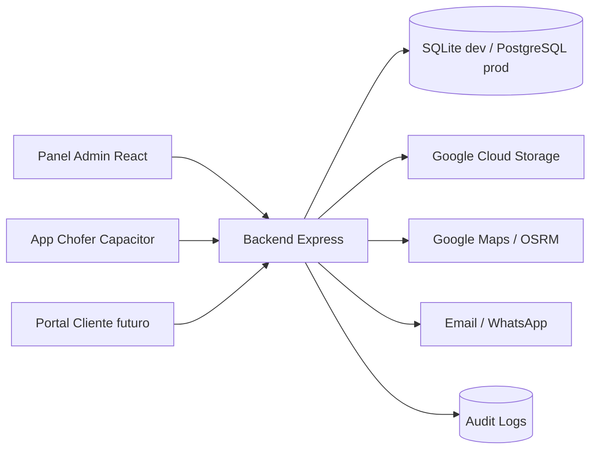

# Arquitectura

## Capas

- UI admin: operaciones, finanzas, RRHH, configuracion y auditoria.
- App chofer: viajes, POD, gastos, tracking e impresion Bluetooth.
- API: auth, RBAC, tenant, reglas, alertas, rutas, facturacion y modulos existentes.
- Datos: SQLite en desarrollo, PostgreSQL objetivo en Cloud SQL.
- Archivos: fallback local/base64 hoy, Cloud Storage objetivo.

## Principios nuevos

- Todo dato operativo debe pertenecer a `tenant_id`.
- Todo endpoint productivo debe autenticar usuario o API key.
- Todo cambio sensible debe generar `audit_logs`.
- Reglas operativas deben bloquear, advertir o crear alertas antes de persistir operaciones criticas.
